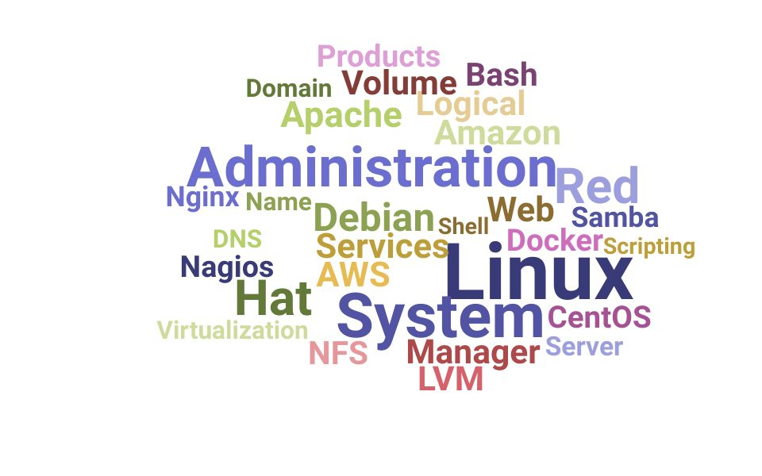

# 🐧 Linux Systems Administration & Engineering Portfolio

Welcome to my hands-on Linux engineering showcase! This repository tracks my journey from foundational core commands to systems architecture, networking, automation, and security configurations.

## 👤 Profile & Environment
* **Name:** Vijay Patel  
* **Role Objective:** Linux Systems Administrator / DevOps Engineer  
* **Lab Environment:** Virtualized Infrastructure

---

## 📂 Completed Core Architecture Labs

explore my step-by-step documentation, command line verification, and system architecture breakdowns below:

*   **[Lab 02: File Management & Link Mechanics](./02-file-management/)**
    *   *Core Focus:* Structural differentiation between Hard Links and Symbolic (Soft) Links using Node tracking (`ls -li`).
*   **[Lab 03: Standard Streams & I/O Redirection](./03-streams-redirection/)**
    *   *Core Focus:* Data stream manipulation, isolating errors (`2>`), merging execution paths (`2>&1`), and piping output pipelines (`|`).
*   **[Lab 04: System Logging & Journal Management](./04-system-logging/)**
    *   *Core Focus:* Diagnosing hardware logs (`dmesg`), real-time event tailing (`journalctl -f`), and safe log cleaning (`--vacuum-size`).

---

## 🚀 Navigation Structure
Each directory listed above serves as a complete **Lab Report**, featuring exact objectives, verification outputs, and notes reflecting production-level systems administration standards.
