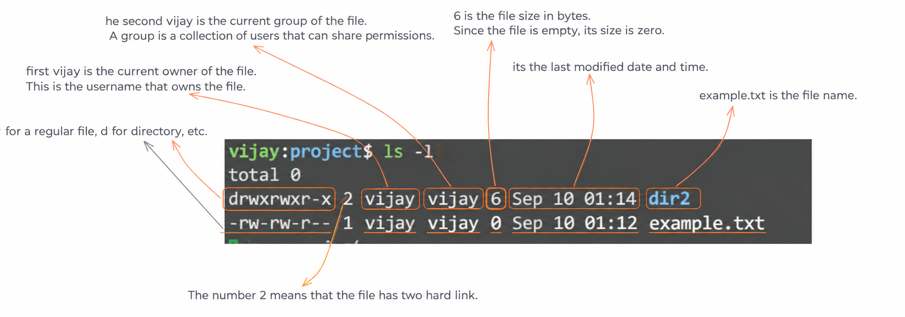

# 📂 Welcome to the lab "Permissions of Files".
We'll explore three essential commands: chown, touch, and chmod. These tools are crucial for managing access to files and directories on a Linux system

## 👉 let's create a new file named: **example.txt**
```bash
touch example.txt
```
## 👉Changing the Ownership of a File
let's check the current ownership of our example.txt file:

```bash
ls -l example.txt
```

> **-rwxrwxrwx 1 vijay vijay 0 Sep 12 14:16 example.txt** <br>
> -rwxrwxrwx 1 vijay vijay 903 Sep 12 14:44 README.md <br>
> drwxrwxrwx 1 vijay vijay 512 Sep 12 14:56 dir2 <br>
> -rwxrwxrwx 1 vijay vijay 0 Sep 12 14:16 example.txt





## 🗃️ Now, let's change the ownership of the file to the root user. root is the administrator

```
sudo chown root:root example.txt
```


> **sudo** runs the command with root privileges. You'll likely be prompted for your password <br>
> **chown** is the command to change ownership. <br>
> **root:root** specifies the new owner and group (both set to root). The syntax is owner:group.<br>
> **example.txt** is the target file.

Let's verify the change:
> **ls -l example.txt** <br>
output: -rw-rw-r-- 1 root root 0 Jul 29 15:11 example.txt

# 🧑‍🦲Changing the Ownership of a Directory
```
mkdir -p new-dir/subdir
echo "Hello, world" > new-dir/file1.txt
echo "Another file" > new-dir/subdir/file2.txt
```
code explain: if use **mkdir new-dir/subdir**, then mkdir say, i dont see new-dir then how can i create subdir? <br>
**-p** using it means , im telling to mkdir to create parent directory(-p) if u dont find. 

Now, let's check the current ownership:
```ls -lR new-dir```
>ls -lR lists the contents of new-dir recursively. <br>
The -R option (recursive) makes ls list all files and subdirectories within new-dir and their contents.


```
vijay:project/ $ ls -lR new-dir
new-dir:
total 4
-rw-rw-r-- 1 vijay vijay 13 Sep 13 03:58 file1.txt
drwxrwxr-x 2 vijay vijay 23 Sep 13 03:58 subdir

new-dir/subdir:
total 4
-rw-rw-r-- 1 vijay vijay  13 Sep 13 03:58 file2.txt
```

 **let's change the ownership of new-dir and all its contents to the root user:**
 ```sudo chown -R root:root new-dir```

 >The -R option tells chown to operate recursively, changing the ownership of all files and <br>
 subdirectories within new-dir. This is crucial; without -R, <br>
 only the new-dir directory's ownership would change, but the files and <br>
 subdirectories within it would still be owned by vijay <br>

**Let's verify the change**
```ls -lR new-dir ```
````new-dir:
total 4
-rw-rw-r-- 1 root root 13 Jul 29 09:15 file1.txt
drwxrwxr-x 2 root root 23 Jul 29 09:15 subdir

new-dir/subdir:
total 4
-rw-rw-r-- 1 root root 13 Jul 29 09:15 file2.txt
````

## 📁 Directory Permissions 

### 1. Create directory

```bash
mkdir ~/test-dir
```

### 2. Check directory permissions

```bash
ls -ld ~/test-dir
```

* `-d` → directory itself show karega, contents nahi.

### 3. Permission meaning for directories

| Permission | Meaning                                                 |
| ---------- | ------------------------------------------------------- |
| `r`        | Directory ke contents **list** kar sakte ho (`ls`)      |
| `w`        | Files/directories **create/delete/rename** kar sakte ho |
| `x`        | Directory **access/traverse** kar sakte ho (`cd`)       |

### 4. `chmod 700`

```bash
chmod 700 ~/test-dir
```

`700` = `rwx------`

* Owner → `rwx`
* Group → `---`
* Others → `---`

### 5. `chmod 755`

```bash
chmod 755 ~/test-dir
```

`755` = `rwxr-xr-x`

* Owner → `rwx`
* Group → `r-x`
* Others → `r-x`

### 6. Recursive permissions

```bash
chmod -R 755 ~/test-dir
```

`-R` → directory ke andar **all files/subdirectories** par permission apply karta hai.

> ⚠️ **Important:** Empty directory ke liye `-R` ki zarurat nahi. `chmod 755 dir` enough hai. And blindly `chmod -R 755` karna files par unwanted execute permission de sakta hai.


